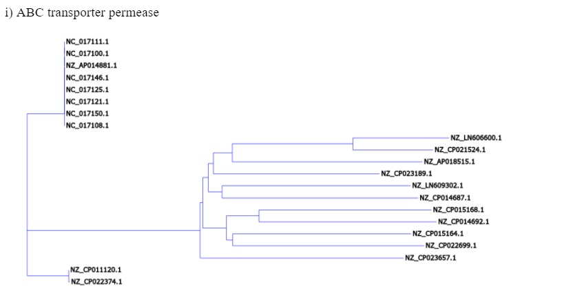
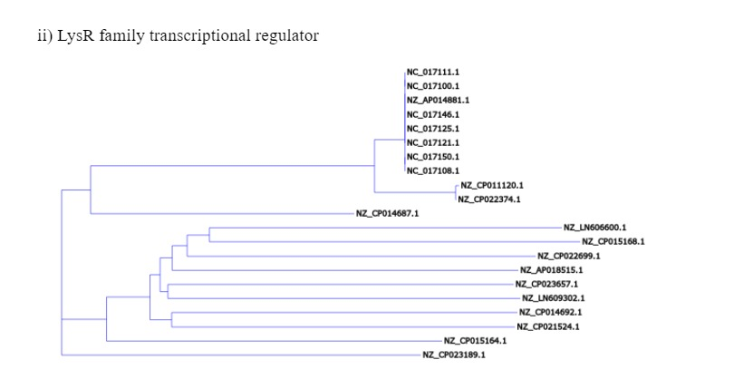
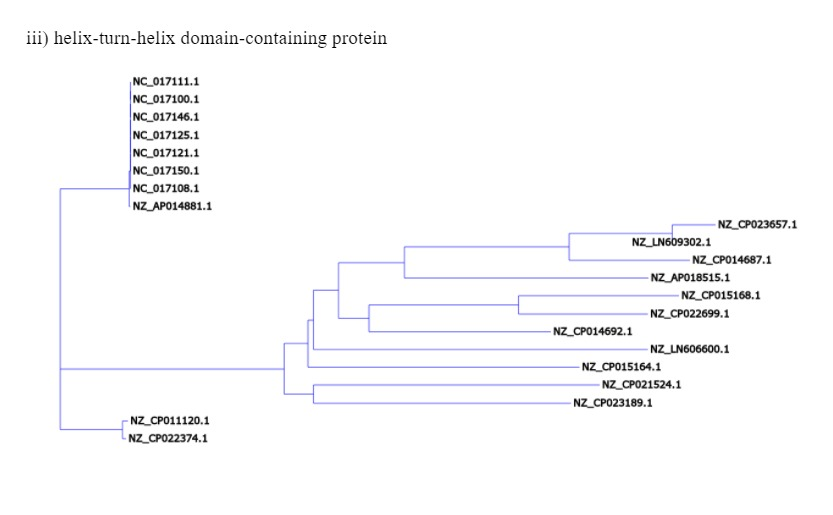
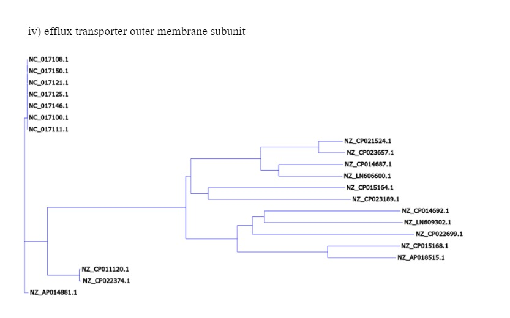

# Assignment - Phylogenetic Trees - Cosmids
## Steps to run code
1. Install following python packages (ex: pip install pythonPackage)
    * biopython
    * ete3
    * pandas
    * Bio
    * prettytable
2. Download comman_bacterial_set : google drive link -  https://drive.google.com/drive/folders/1Vvl4c0Iz6lz_RP3NsdmVOCa6lcJcqNcm?usp=sharing

3. Open folder named data_and_code_Cosmids
4. Open command line and navigate to data_and_code_Cosmids folder
5. Run command : main.py

# Output

## Common Bacteria set

* NZ_CP014692.1 
* NZ_AP018515.1 
* NC_017121.1   
* NZ_LN606600.1 
* NZ_LN609302.1 
* NZ_CP015164.1 
* NZ_CP023657.1
* NZ_CP023189.1
* NC_017146.1
* NZ_AP014881.1
* NC_017108.1
* NZ_CP015168.1
* NZ_CP014687.1
* NZ_CP022699.1
* NZ_CP022374.1
* NC_017111.1
* NZ_CP021524.1
* NZ_CP011120.1
* NC_017150.1
* NC_017125.1
* NC_017100.1

## Generated Trees
* Phylogenatic trees were generated using clustal phylogeny and clustal omega softwares
1. ABC transporter permease


2. LysR family transcriptional regulator


3. helix-turn-helix domain-containing protein


4. efflux transporter outer membrane subunit



```+----------------+--------------------------------------------+---------+---------+
|  Accession ID  |                Protein name                |  Start  |   End   |
+----------------+--------------------------------------------+---------+---------+
| NZ_CP014692.1  |          ABC transporter permease          |  214989 |  215756 |
| NZ_AP018515.1  |          ABC transporter permease          |  38328  |  39287  |
|  NC_017121.1   |          ABC transporter permease          |  138760 |  139578 |
| NZ_LN606600.1  |          ABC transporter permease          |  80900  |  82048  |
| NZ_LN609302.1  |          ABC transporter permease          |  51798  |  52970  |
| NZ_CP015164.1  |          ABC transporter permease          |  32236  |  33840  |
| NZ_CP023657.1  |          ABC transporter permease          |  109663 |  110712 |
| NZ_CP023189.1  |          ABC transporter permease          |  207292 |  208851 |
|  NC_017146.1   |          ABC transporter permease          |  138760 |  139578 |
| NZ_AP014881.1  |          ABC transporter permease          |  136243 |  137061 |
|  NC_017108.1   |          ABC transporter permease          |  138760 |  139578 |
| NZ_CP015168.1  |          ABC transporter permease          |  22271  |  23056  |
| NZ_CP014687.1  |          ABC transporter permease          |  56129  |  57256  |
| NZ_CP022699.1  |          ABC transporter permease          |  20827  |  21678  |
| NZ_CP022374.1  |          ABC transporter permease          |  136111 |  136929 |
|  NC_017111.1   |          ABC transporter permease          |  138760 |  139578 |
| NZ_CP021524.1  |          ABC transporter permease          |  240268 |  241473 |
| NZ_CP011120.1  |          ABC transporter permease          |  139385 |  140203 |
|  NC_017150.1   |          ABC transporter permease          |  138760 |  139578 |
|  NC_017125.1   |          ABC transporter permease          |  138760 |  139578 |
|  NC_017100.1   |          ABC transporter permease          |  138760 |  139578 |
| NZ_CP014692.1  |   LysR family transcriptional regulator    |  63174  |  64115  |
| NZ_AP018515.1  |   LysR family transcriptional regulator    |  379517 |  380431 |
|  NC_017121.1   |   LysR family transcriptional regulator    |  44664  |  45029  |
| NZ_LN606600.1  |   LysR family transcriptional regulator    |  481992 |  482918 |
| NZ_LN609302.1  |   LysR family transcriptional regulator    |   963   |   1892  |
| NZ_CP015164.1  |   LysR family transcriptional regulator    |  121923 |  122864 |
| NZ_CP023657.1  |   LysR family transcriptional regulator    |   333   |   1220  |
| NZ_CP023189.1  |   LysR family transcriptional regulator    |  149259 |  150152 |
|  NC_017146.1   |   LysR family transcriptional regulator    |  44664  |  45029  |
| NZ_AP014881.1  |   LysR family transcriptional regulator    |  42099  |  42464  |
|  NC_017108.1   |   LysR family transcriptional regulator    |  44664  |  45029  |
| NZ_CP015168.1  |   LysR family transcriptional regulator    |  248637 |  249503 |
| NZ_CP014687.1  |   LysR family transcriptional regulator    |  14424  |  15347  |
| NZ_CP022699.1  |   LysR family transcriptional regulator    |  18042  |  18938  |
| NZ_CP022374.1  |   LysR family transcriptional regulator    |  42006  |  42371  |
|  NC_017111.1   |   LysR family transcriptional regulator    |  44664  |  45029  |
| NZ_CP021524.1  |   LysR family transcriptional regulator    |  754589 |  755500 |
| NZ_CP011120.1  |   LysR family transcriptional regulator    |  45285  |  45650  |
|  NC_017150.1   |   LysR family transcriptional regulator    |  44664  |  45029  |
|  NC_017125.1   |   LysR family transcriptional regulator    |  44664  |  45029  |
|  NC_017100.1   |   LysR family transcriptional regulator    |  44664  |  45029  |
| NZ_CP014692.1  | helix-turn-helix domain-containing protein |  55106  |  57319  |
| NZ_AP018515.1  | helix-turn-helix domain-containing protein |  359001 |  359579 |
|  NC_017121.1   | helix-turn-helix domain-containing protein |  315904 |  316398 |
| NZ_LN606600.1  | helix-turn-helix domain-containing protein | 1311595 | 1312500 |
| NZ_LN609302.1  | helix-turn-helix domain-containing protein |  289340 |  289609 |
| NZ_CP015164.1  | helix-turn-helix domain-containing protein |  748077 |  749357 |
| NZ_CP023657.1  | helix-turn-helix domain-containing protein |  17020  |  17271  |
| NZ_CP023189.1  | helix-turn-helix domain-containing protein |  29399  |  29662  |
|  NC_017146.1   | helix-turn-helix domain-containing protein |  315904 |  316398 |
| NZ_AP014881.1  | helix-turn-helix domain-containing protein |  294358 |  294852 |
|  NC_017108.1   | helix-turn-helix domain-containing protein |  315904 |  316398 |
| NZ_CP015168.1  | helix-turn-helix domain-containing protein | 1086506 | 1086736 |
| NZ_CP014687.1  | helix-turn-helix domain-containing protein |  202443 |  202718 |
| NZ_CP022699.1  | helix-turn-helix domain-containing protein |  40006  |  40275  |
| NZ_CP022374.1  | helix-turn-helix domain-containing protein |  311284 |  311778 |
|  NC_017111.1   | helix-turn-helix domain-containing protein |  315904 |  316398 |
| NZ_CP021524.1  | helix-turn-helix domain-containing protein |  99530  |  100810 |
| NZ_CP011120.1  | helix-turn-helix domain-containing protein |  320717 |  321211 |
|  NC_017150.1   | helix-turn-helix domain-containing protein |  315910 |  316404 |
|  NC_017125.1   | helix-turn-helix domain-containing protein |  315904 |  316398 |
|  NC_017100.1   | helix-turn-helix domain-containing protein |  315904 |  316398 |
| NZ_CP014692.1  | efflux transporter outer membrane subunit  |  999992 | 1001515 |
| NZ_AP018515.1  | efflux transporter outer membrane subunit  | 1427079 | 1428593 |
|  NC_017121.1   | efflux transporter outer membrane subunit  |  155470 |  156954 |
| NZ_LN606600.1  | efflux transporter outer membrane subunit  |  136496 |  138073 |
| NZ_LN609302.1  | efflux transporter outer membrane subunit  |  303038 |  304606 |
| NZ_CP015164.1  | efflux transporter outer membrane subunit  |    98   |   1621  |
| NZ_CP023657.1  | efflux transporter outer membrane subunit  |  559625 |  561190 |
| NZ_CP023189.1  | efflux transporter outer membrane subunit  |  141770 |  143359 |
|  NC_017146.1   | efflux transporter outer membrane subunit  |  155470 |  156954 |
| NZ_AP014881.1  | efflux transporter outer membrane subunit  |  151284 |  152768 |
|  NC_017108.1   | efflux transporter outer membrane subunit  |  155470 |  156954 |
| NZ_CP015168.1  | efflux transporter outer membrane subunit  |  561625 |  563154 |
| NZ_CP014687.1  | efflux transporter outer membrane subunit  |  768608 |  770161 |
| NZ_CP022699.1  | efflux transporter outer membrane subunit  |  117718 |  119154 |
| NZ_CP022374.1  | efflux transporter outer membrane subunit  |  152018 |  153502 |
|  NC_017111.1   | efflux transporter outer membrane subunit  |  155470 |  156954 |
| NZ_CP021524.1  | efflux transporter outer membrane subunit  |  294338 |  295903 |
| NZ_CP011120.1  | efflux transporter outer membrane subunit  |  154424 |  155908 |
|  NC_017150.1   | efflux transporter outer membrane subunit  |  155470 |  156954 |
|  NC_017125.1   | efflux transporter outer membrane subunit  |  155470 |  156954 |
|  NC_017100.1   | efflux transporter outer membrane subunit  |  155470 |  156954 |
+----------------+--------------------------------------------+---------+---------+